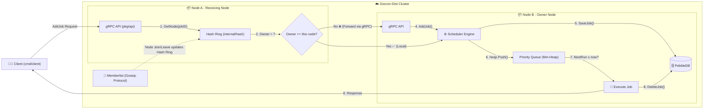

# gocron-dist

**gocron-dist** is a distributed job scheduler written in Go. It is designed to be resilient, scalable, and persistent, solving the limitations of traditional single-node cron jobs.

## Features

- **Distributed Architecture**: Runs on multiple nodes; if one node fails, the cluster continues to function.
- **Recurring Tasks**: Support for periodic jobs with configurable intervals and execution limits.
- **Persistence**: Jobs are saved to disk using [PebbleDB](https://github.com/cockroachdb/pebble), ensuring no data loss during restarts.
- **Clustering**: Uses [Memberlist](https://github.com/hashicorp/memberlist) (Gossip protocol) for node discovery and failure detection.
- **Horizontal Scaling**: Jobs are distributed across nodes using **Consistent Hashing** with automatic rebalancing.
- **Observability**: Built-in distributed tracing using OpenTelemetry (OTel).
- **gRPC API**: Submit and manage jobs programmatically via gRPC.

## Architecture

The system consists of several key components:

- **Engine**: The core scheduler that manages the priority queue of jobs and triggers execution.
- **Cluster**: Handles node membership and failure detection.
- **Hash Ring**: Determines which node is responsible for a specific job ID.
- **Storage**: Persistent storage layer for jobs.

### Workflow Diagram



### How It Works

| Step | Component | Description |
|------|-----------|-------------|
| 1 | Hash Ring | `GetNode(jobID)` determines the owner node via CRC32 Consistent Hashing |
| 2-3 | Decision | If the owner is not this node, the request is **forwarded** via gRPC |
| 4 | Engine | The owner node's `AddJob()` receives the job |
| 5 | PebbleDB | Job is **persisted** to disk to survive restarts |
| 6 | Priority Queue | Job is pushed onto a min-heap sorted by `NextRun` time |
| 7 | Scheduler Loop | Engine continuously checks: when `NextRun ≤ now`, the job is popped |
| 8 | Cleanup | After execution, the job is **deleted** from PebbleDB |
| bg | Memberlist | Gossip protocol keeps the Hash Ring updated as nodes join/leave |

## Installation

```bash
go get github.com/vnmchuo/gocron-dist
```

## Usage

### Running the Server

```bash
# Start the first node
go run cmd/server/main.go -port 8001 -grpc-port 9001 -name node-1

# Start a second node and join the cluster
go run cmd/server/main.go -port 8002 -grpc-port 9002 -name node-2 -join localhost:8001
```

### Scheduling a Job (Client)

```bash
go run cmd/client/main.go -target localhost:9001 -id "job-1" -delay 5 -msg "Send Email"
```

## Examples

We provide several examples to help you get started:

- **[Basic Usage](examples/basic/main.go)**: Learn how to use the core scheduler engine in a simple, non-distributed setup.
- **[Distributed Setup](examples/distributed/main.go)**: See how to initialize a distributed node programmatically.

## Known Limitations & Trade-offs

- **Split-Brain Behavior**: In the event of a network partition, multiple nodes might believe they own the same job if they cannot see each other via the Gossip protocol. This can lead to duplicate executions.
- **Job Loss Risk**: There is a small window between receiving a job via gRPC and persisting it to PebbleDB where a node failure could lead to job loss.
- **At-Least-Once Delivery**: The system guarantees at-least-once delivery. In some failure scenarios (like network timeouts during deletion), a job might be executed more than once.
- **Node Failure Recovery**: Job re-assignment only works for jobs already known to surviving nodes. If a node fails and its local PebbleDB is inaccessible, the jobs it owned cannot be re-assigned until the node or its storage is recovered.
- **Best-Effort Rebalancing**: Re-assignment on node membership changes is best-effort and depends on the successful forwarding of jobs via gRPC.

## Internal Process

We are excited to embrace human-AI collaboration in the development of this project. **Gocron-Dist** leverages the assistance of **Gemini AI** to automate internal documentation and change tracking (*dev logs*), which significantly accelerates our iteration cycles and ensures that technical transparency is maintained to a high standard.

## Contributing

Contributions are welcome! Please see [CONTRIBUTING.md](CONTRIBUTING.md) for details.

## Changelog

See [CHANGELOG.md](CHANGELOG.md) for a history of changes.

## License

This project is licensed under the MIT License - see the [LICENSE](LICENSE) file for details.
